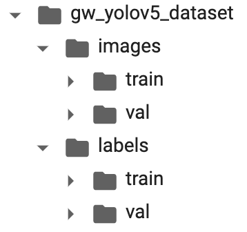
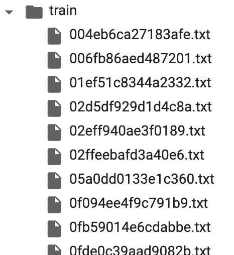
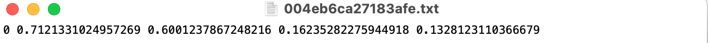
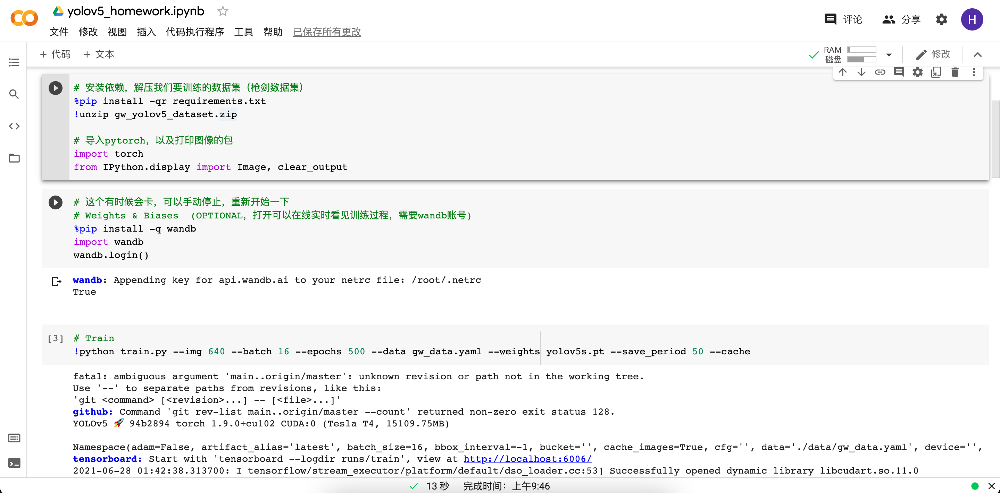
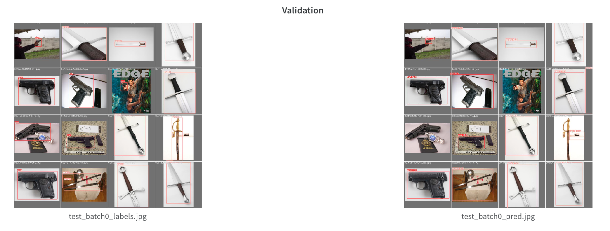
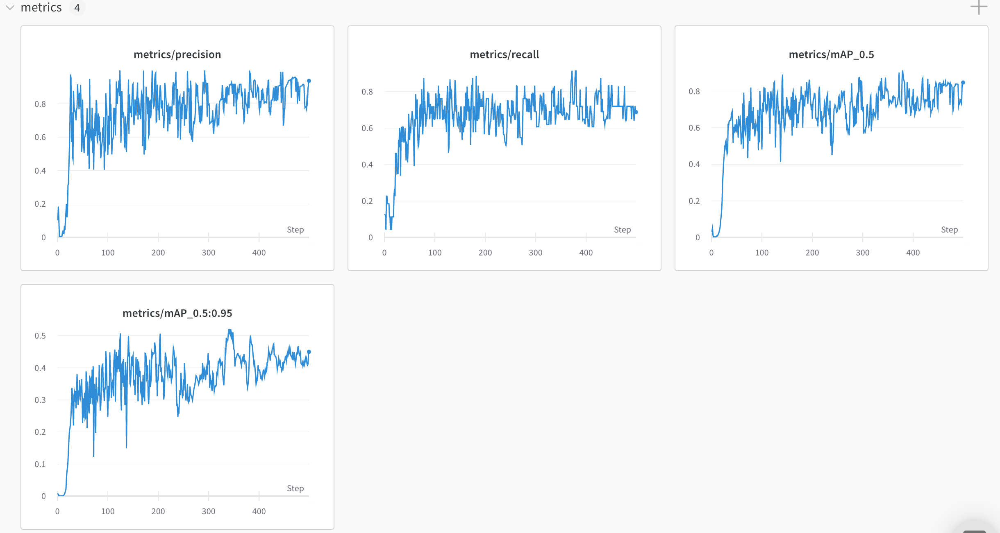
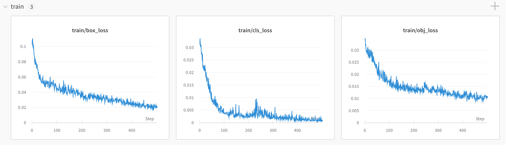
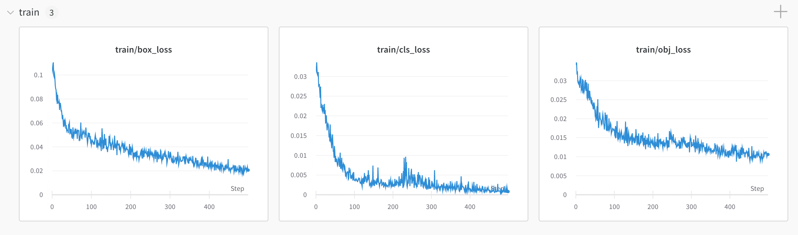
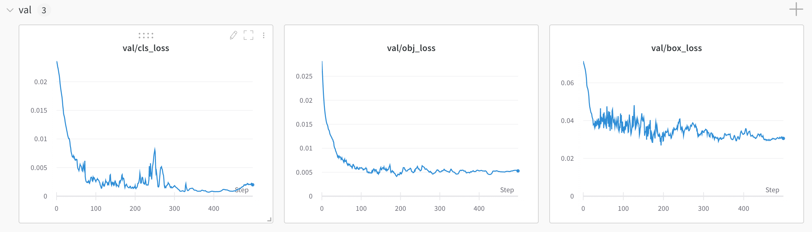

https://github.com/Harryee/yolov5_homework

# Introduction

A tutorial about how to use yolov5(https://github.com/ultralytics/yolov5) to train your own dataset with pre-trained model.

# Prepare

We need:

- Google Drive account
- Colab account
- VoTT

# How to use it?

### 1. Prepare your own dataset

I use a dataset provided by my tutor, a dataset include pitcures about swords and guns. Then I use VoTT(a tool) to build my own dataset in specific format. Here is a screenshot of VoTT, it is a very useful and simple tool, and you can find a tutorial by Google or Baidu easily.


After you finish doing your job, save them in Yolo format(The latest VoTT does not allow we save in Yolo format, so I highly recommand you to use V1.7.1). But actually we do not use Yolo format, but we can reform it into the format we use easily, like this:



The images folder save the original images, and the labels folder save details about the images and every images has its own label. We save the detail of every single image in an individual txt file, like this:



And we form the txt file in an specific format, like this:



```
class_type center_x center_y width height
[class_type center_x center_y width height]
[class_type center_x center_y width height]
...
```

If this image doesn't have target, you don't have to make a file for it, and center_x and center_y here are normalized.

Then we have to write a yaml file to make sure our project knows where the dataset is and some basic information about the dataset, like this:

```yaml
# train and val data as 1) directory: path/images/, 2) file: path/images.txt, or 3) list: [path1/images/, path2/images/]
train: ./gw_yolov5_dataset/images/train/
val: ./gw_yolov5_dataset/images/val/

# number of classes
nc: 2

# class names
names: [ 'gun', 'sword' ]
```


## 2. Train on colab

Click [](https://colab.research.google.com/drive/1As7FOJi6hf6aDDK-K2rTns5aXeF-FQzK?usp=sharing) to open yolov5_homework.ipynb on colab. You can run it right away by the dataset I made, and I already write some note in the notebook. If you want to train on your own dataset, just try to upload your own dataset and form it like the format I mentioned and change a little code about the dataset's path.




# Done

After all, you can get your own model and some evaluation result like mAP and so on.

Here are some matrics about my model generated by wandb, I think wandb is very useful when you are using colab.











# Reference

https://github.com/ultralytics/yolov5
